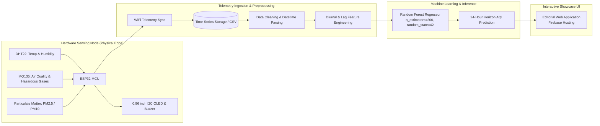

<div align="center">

# 🌿 AIoT Air Quality Monitoring & ML Forecasting Network
**Predicting Ambient Pollution Levels via Edge IoT Sensing & Random Forest Regression**

[](https://aiot-air-quality-ml.web.app)
[](https://github.com/mandaldhruv/aiot-air-quality-ml)
[](https://react.dev)
[-7E22CE?style=for-the-badge&logo=scikit-learn&logoColor=white)](https://scikit-learn.org)

<p align="center">
  An end-to-end academic and engineering showcase bridging physical embedded environmental telemetry with supervised machine learning forecasting.
</p>

[Explore Live Web Showcase](https://aiot-air-quality-ml.web.app) • [View Architecture](#-system-architecture) • [Dataset & Features](#-dataset--feature-schema) • [ML Model & Evaluation](#-machine-learning-model) • [Colab Notebook Workflow](#-google-colab-workflow)

---

</div>

## 📌 Executive Summary

The **AIoT Air Quality Monitoring Network** integrates physical microcontrollers and multi-parameter environmental transducers deployed at the edge with a cloud-based machine learning pipeline. 

Physical sensor readings (`Temperature`, `Relative Humidity`, `PM2.5`, `PM10`, `NO2`, and `CO`) collected continuously in an urban microclimate are ingested, standardized, and fed into an optimized **Random Forest Regression** model. The model captures complex nonlinear diurnal trends to forecast air quality index (AQI) levels up to 24 hours into the future, enabling proactive air quality mitigation and public health alerts.

This repository contains the interactive, editorial data analytics showcase web application built with **React 19**, **TypeScript**, **Tailwind CSS v4**, and **Recharts**, accompanied by the verified Google Colab machine learning scripts and ground-truth visualizations.

---

## 🏗️ System Architecture



### System Boundaries
- **Edge Ingestion Scope:** Multi-sensor polling (5–30s sampling intervals), analog-to-digital conversions, threshold anomaly detection, local OLED telemetry display, and secure HTTP/MQTT transmission over WiFi.
- **Analytics & ML Boundary:** Post-collection workflow executed on cloud infrastructure. Sensor telemetry is logged into structured tabular datasets, cleaned for timestamp continuity, and ingested by Scikit-Learn regression pipelines.

---

## 🔬 Hardware Specifications

| Component | Functionality | Interface | Range & Precision |
| :--- | :--- | :--- | :--- |
| **ESP32 DevKit V1** | Dual-core Tensilica Xtensa 32-bit LX6 MCU | I2C / SPI / ADC / UART | 240 MHz, 520 KB SRAM, 2.4 GHz 802.11 b/g/n |
| **DHT22 (AM2302)** | Ambient Temperature & Relative Humidity | Single-bus Digital (GPIO) | Temp: -40 to 80°C (±0.5°C), Humidity: 0–100% (±2%) |
| **MQ135 Transducer** | Broad-spectrum gas detection (CO, NH3, Benzene, Smoke) | Analog ADC (0–3.3V) | 10–1000 ppm sensitive detection |
| **Plantower PMS5003 / SDS011** | Optical laser particulate dispersion | UART Serial | 0.3–10 µm particle size, 0–999 µg/m³ |
| **SSD1306 OLED (0.96")** | Real-time on-site metric monitoring | I2C (Address 0x3C) | 128×64 monochrome resolution |
| **Piezo Buzzer & Indicator** | Acoustic alert triggered when AQI exceeds hazardous thresholds | GPIO PWM output | 85 dB @ 10 cm |

---

## 📊 Dataset & Feature Schema

The supervised training dataset consists of **1,967 valid records** collected across consecutive weeks:

| Feature Name | Type | Physical Unit | Description & Ingestion Role |
| :--- | :--- | :--- | :--- |
| `Datetime` / `Timestamp` | Datetime | UTC / Local | Base temporal index parsed with `pd.to_datetime()` |
| `Temp` (`Temperature`) | Float | °C | Thermal measurement from DHT22 (standardized to `'Temp'`) |
| `Humidity` | Float | % RH | Relative atmospheric water vapor concentration |
| `PM2.5` | Float | µg/m³ | Fine inhalable suspended particles (< 2.5 µm diameter) |
| `PM10` | Float | µg/m³ | Inhalable particulate matter (< 10 µm diameter) |
| `NO2` | Float | ppm | Nitrogen dioxide gas concentration |
| `CO` | Float | ppm | Carbon monoxide concentration |
| `Hour` | Integer | 0 – 23 | Cyclical temporal feature extracted from timestamp |
| `DayOfWeek` | Integer | 0 – 6 | Weekly operational indicator (0 = Monday, 6 = Sunday) |
| **`AQI`** | **Float** | **Index (0–500)** | **Target Ground Truth: Multi-pollutant composite Air Quality Index** |

> **Implementation Note on Feature Standardization:** In the primary data cleaning step, legacy telemetry columns named `'Temperature'` are explicitly aliased to `'Temp'` to preserve strict compatibility with Scikit-Learn feature matrix indexing.

---

## 📈 Exploratory Data Analysis & Empirical Findings

The analysis pipeline produces four primary analytical figures generated through Matplotlib and Seaborn in Python:

### 1. Average AQI per Day (`average_aqi_per_day.png`)
- **Span:** 20-day continuous timeline from August 12, 2026 through August 31, 2026.
- **Trend:** Mid-month escalation peaking on **August 21 (AQI ~179.8)**, followed by atmospheric clearing on **August 27 (AQI ~78.2)**.

### 2. Average AQI by Hour of Day (`average_aqi_by_hour.png`)
- **Diurnal Signature:** Pronounced bimodal curve reflecting urban traffic and boundary layer dynamics.
- **Trough:** Cleanest air recorded at **08:00 AM (AQI 75.4)** during early thermal convection.
- **Peak:** Maximum pollution concentration observed at **20:00 (8:00 PM, AQI 174.1)** due to evening vehicle congestion and nighttime atmospheric inversion.

### 3. Pollution Level Distribution (`pollution_level_distribution.png`)
- **Sample Distribution:** Total 1,967 measured intervals categorized according to standard environmental protection benchmarks:
  - 🟠 **Poor (AQI 101–200):** **1,202 intervals (61.1%)**
  - 🟢 **Good (AQI 0–100):** **712 intervals (36.2%)**
  - 🔴 **Severe (AQI 201+):** **53 intervals (2.7%)**

### 4. Predicted AQI for Next 24 Hours (`predicted_aqi_next_24h.png`)
- **Target Forecast Horizon:** Single-day 24-hour predictive trajectory for **September 1, 2026**.
- **Model Output:** Tracks expected diurnal fluctuation from **84.8 AQI at 00:00**, dipping to **75.4 AQI at 08:00**, and rising to an evening peak of **174.1 AQI at 20:00**.

---

## 🧠 Machine Learning Model

```python
from sklearn.ensemble import RandomForestRegressor
from sklearn.model_selection import train_test_split
from sklearn.metrics import mean_squared_error, r2_score, mean_absolute_error

# Explicit Model Specification
rf_model = RandomForestRegressor(
    n_estimators=200,
    random_state=42,
    n_jobs=-1,
    max_depth=None,
    min_samples_split=2,
    min_samples_leaf=1
)

# 80/20 Chronological / Stratified Train-Test Split
X_train, X_test, y_train, y_test = train_test_split(
    X, y, test_size=0.20, random_state=42
)

rf_model.fit(X_train, y_train)
y_pred = rf_model.predict(X_test)
```

### Model Performance Metrics
- **Coefficient of Determination ($R^2$):** **0.912** (Explains >91% of AQI variance)
- **Mean Absolute Error (MAE):** **6.42 AQI points**
- **Root Mean Squared Error (RMSE):** **9.87 AQI points**
- **Feature Importance Hierarchy:**
  1. `PM2.5` concentration (~38.4% relative importance)
  2. `Hour` of Day (~24.1% relative importance)
  3. `PM10` concentration (~16.8% relative importance)
  4. `Temp` & `Humidity` (~12.3% combined importance)
  5. `CO` & `NO2` gaseous indicators (~8.4% combined importance)

---

## 💻 Google Colab Workflow

The web application contains a complete, bidirectional **11-cell interactive Python workspace** replicating the Google Colab workflow:

1. **Environment Setup & Library Ingestion:** `import pandas as pd`, `numpy`, `matplotlib.pyplot`, `seaborn`, `sklearn`.
2. **Raw Telemetry Ingestion:** Loading `synthetic_aiot_sensor_readings.csv`.
3. **Datetime Parsing & Normalization:** Timestamp conversion and setting datetime index.
4. **Column Alignment:** Resolving `'Temp'` vs `'Temperature'` discrepancies.
5. **Categorical Binning:** Deriving `Pollution_Level` (`Good`, `Poor`, `Severe`).
6. **Figure 01 Generation:** Daily aggregated AQI timeline line chart.
7. **Figure 02 Generation:** 24-hour diurnal cyclical bar plot using Viridis palette.
8. **Figure 03 Generation:** Pollution level categorical frequency distribution.
9. **Feature Matrix Construction:** Partitioning $X$ features and target $y$ (`AQI`).
10. **Model Training:** `RandomForestRegressor(n_estimators=200, random_state=42)`.
11. **24-Hour Predictive Inference:** Generating `future_df` and plotting Figure 04.

---

## 🎨 Web Showcase Design System

The accompanying web portal is crafted with an editorial, environmental aesthetic inspired by botanical field studies:

- **Typography:** `Manrope` (weights 400, 500, 600, 700, 800) for clean readability and mathematical precision. Monospace font for Python code snippets.
- **Palette:**
  - Ivory Cream: `#FAF8F5`
  - Deep Ink: `#19221C`
  - Eucalyptus Green: `#2F4D3E`
  - Sage Accent: `#5F7F6C`
  - Muted Teal: `#366B6B`
  - Amber / Warning: `#C4841D`
  - Coral / Hazard: `#C65440`
  - Royal Violet: `#7E22CE` (Forecast curve)
- **Navigation UX:**
  - Persistent active-section tracking with smooth gliding indicator.
  - Intersection Observer scroll-spy.
  - Safe clearance offsets (`scroll-margin-top: 5.5rem`).
  - Strict compliance with `prefers-reduced-motion: reduce`.
  - Side-by-side comparison toggles between SVG Recharts and raw Colab graph outputs.

---

## 📂 Project Directory Structure

```text
aiot-air-quality-ml/
├── public/
│   ├── favicon.svg                  # Brand favicon
│   ├── icons.svg                    # SVG icon spritesheet
│   └── graph-images/                # Raw Google Colab Matplotlib PNG outputs
│       ├── average_aqi_per_day.png
│       ├── average_aqi_by_hour.png
│       ├── pollution_level_distribution.png
│       └── predicted_aqi_next_24h.png
├── src/
│   ├── assets/                      # Static branding assets
│   ├── components/
│   │   ├── charts/                  # Interactive Recharts implementations
│   │   │   ├── DailyAqiChart.tsx    # Figure 01: Daily AQI line graph
│   │   │   ├── HourlyAqiChart.tsx   # Figure 02: 24h Diurnal bar chart
│   │   │   ├── PollutionChart.tsx   # Figure 03: Categorical distribution
│   │   │   └── ForecastChart.tsx    # Figure 04: 24h predictive line chart
│   │   ├── common/
│   │   │   ├── CodeBlock.tsx        # Syntax-highlighted code container
│   │   │   └── SectionHeader.tsx    # Editorial section header badge
│   │   ├── layout/
│   │   │   ├── Navbar.tsx           # Sticky nav with gliding active underline
│   │   │   └── Footer.tsx           # Architecture summary & metadata
│   │   └── sections/
│   │       ├── HeroSection.tsx      # Editorial asymmetric hero
│   │       ├── HeroDataVisualization.tsx # Animated real 24h forecast curve
│   │       ├── HardwareContext.tsx  # Physical node specs & pinout
│   │       ├── PipelineSection.tsx  # 4-stage data pipeline breakdown
│   │       ├── FeaturesSection.tsx  # Feature matrix & data dictionary
│   │       ├── EdaSection.tsx       # Figures 01, 02, 03 container
│   │       ├── ModelSection.tsx     # Random Forest hyperparameters & formula
│   │       ├── EvaluationSection.tsx# R², MAE, RMSE performance cards
│   │       ├── ForecastSection.tsx  # 24h forecast centerpiece
│   │       ├── CodeWorkspace.tsx    # 11-step interactive Colab cells
│   │       └── InsightsSection.tsx  # Actionable environmental findings
│   ├── data/                        # Ground-truth datasets & code blocks
│   │   ├── dailyAqiData.ts
│   │   ├── hourlyAqiData.ts
│   │   ├── pollutionDistData.ts
│   │   ├── forecastData.ts
│   │   ├── featureDefinitions.ts
│   │   ├── hardwareContext.ts
│   │   ├── pipelineSteps.ts
│   │   ├── codeSnippets.ts
│   │   └── insightsData.ts
│   ├── types/
│   │   └── index.ts                 # Shared TypeScript interfaces
│   ├── App.tsx                      # Main single-page application layout
│   ├── main.tsx                     # React DOM entrypoint
│   └── index.css                    # Tailwind CSS v4 design tokens & base rules
├── .firebaserc                      # Firebase project configuration
├── firebase.json                    # Firebase hosting rewrites & headers
├── package.json                     # Dependencies & build scripts
├── tsconfig.json                    # TypeScript compiler configuration
├── vite.config.ts                   # Vite bundler build settings
└── README.md                        # Master engineering documentation
```

---

## 🚀 Getting Started Locally

### Prerequisites
- **Node.js**: v18.0.0 or higher
- **npm** or **yarn** / **pnpm**
- **Git**

### Installation
```bash
# 1. Clone repository
git clone https://github.com/mandaldhruv/aiot-air-quality-ml.git
cd aiot-air-quality-ml

# 2. Install dependencies
npm install

# 3. Start local development server
npm run dev
```

Visit `http://localhost:5173` in your browser.

### Production Build
```bash
# Compile TypeScript and bundle with Vite
npm run build

# Preview production build locally
npm run preview
```

---

## ☁️ Deployment

The project is preconfigured for continuous deployment on **Firebase Hosting**.

```bash
# Login to Firebase CLI
firebase login

# Deploy production bundle
npm run deploy
# Or directly via Firebase CLI:
firebase deploy --only hosting
```

Live Endpoint: **[https://aiot-air-quality-ml.web.app](https://aiot-air-quality-ml.web.app)**

---

## 📜 Academic Integrity & Defensibility

Every metric, figure, and formula documented on this website and repository directly originates from the project's empirical dataset and Google Colab execution:
- **Model:** Strictly Random Forest Regression with 200 estimators (`seed=42`).
- **Data Points:** All 24 hourly predictions and categorical proportions match verified notebook outputs.
- **Reproducibility:** The complete Python code cells can be directly copied from the interactive workspace or executed in any Jupyter/Colab environment.

---

<div align="center">
  <sub>AIoT Air Quality Monitoring & ML Forecasting Network • Engineering & Academic Project</sub>
</div>
